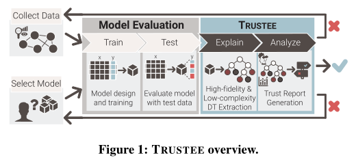

## [2022 CCS] AI/ML for Network Security: The Emperor has no Clothes

提供合成高保真和低复杂度的决策树，帮助网络运营商确定其ML模型是否存在规格问题  
> TRUSTEE (TRUSt-oriented decision TreE Extraction)
- evidence of shortcut learning
- presence of spurious correlations
- vulnerability to outof-distribution samples

AI/ML中的不规范问题指的是: 确定一个训练过的模型的成功是否真的是因为它天生具有编码底层系统或数据的一些基本结构的能力，还是仅仅是训练过的模型碰巧编码的一些归纳偏差的结果  

