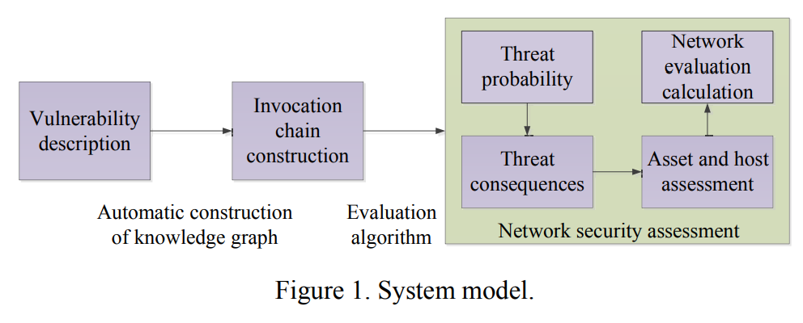
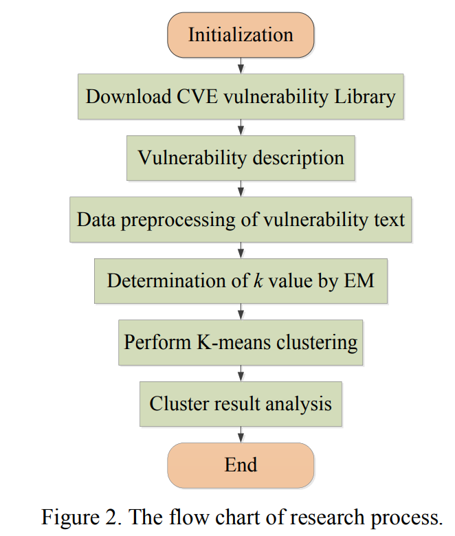
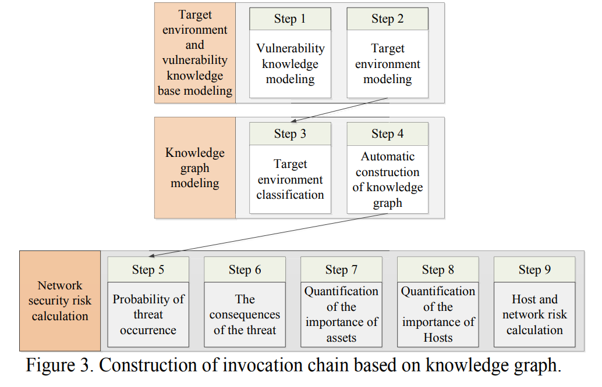
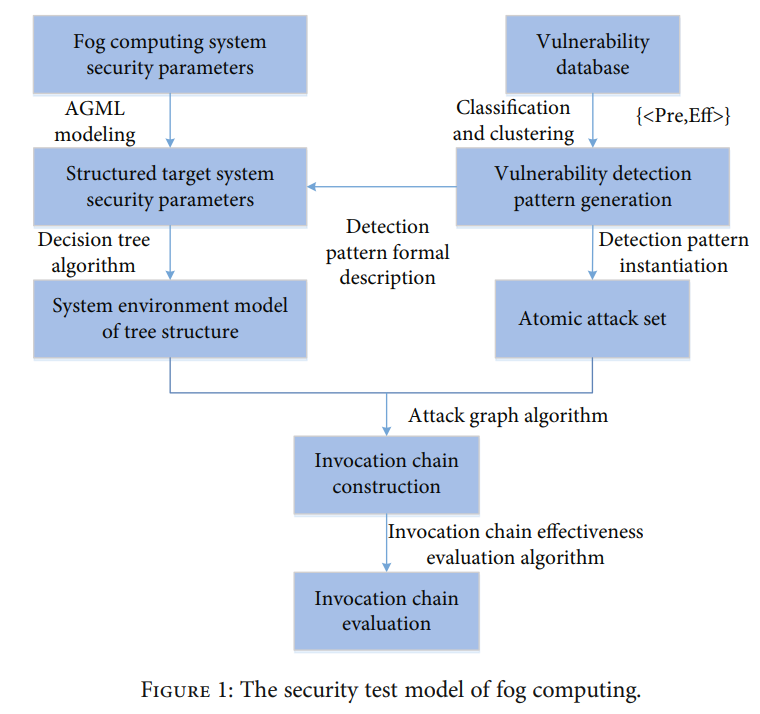
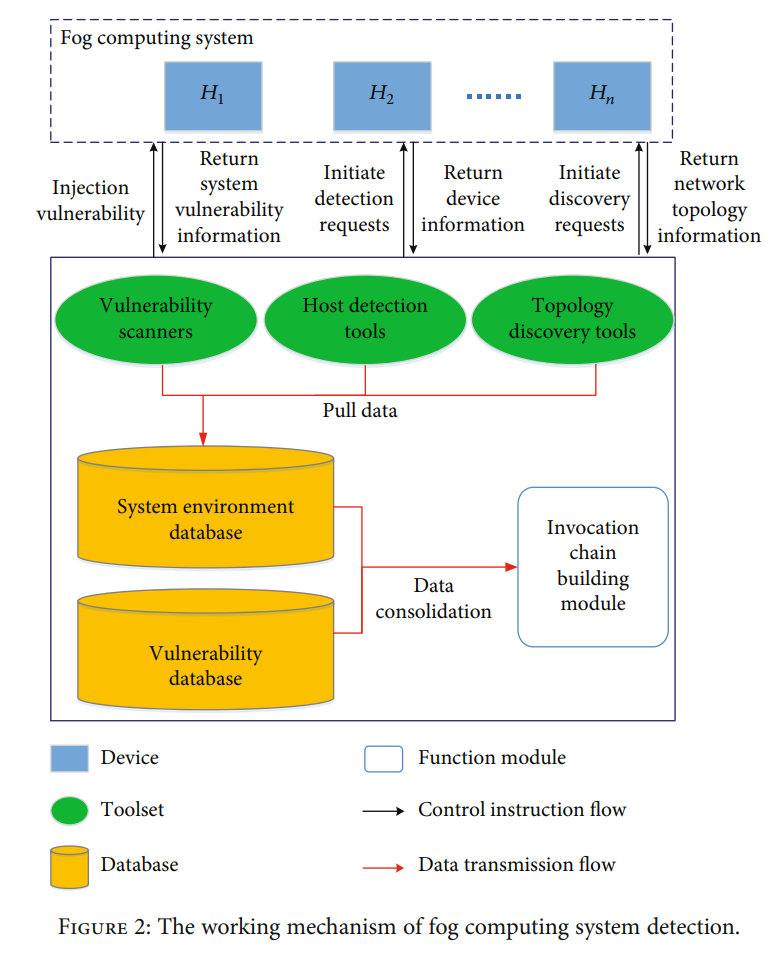
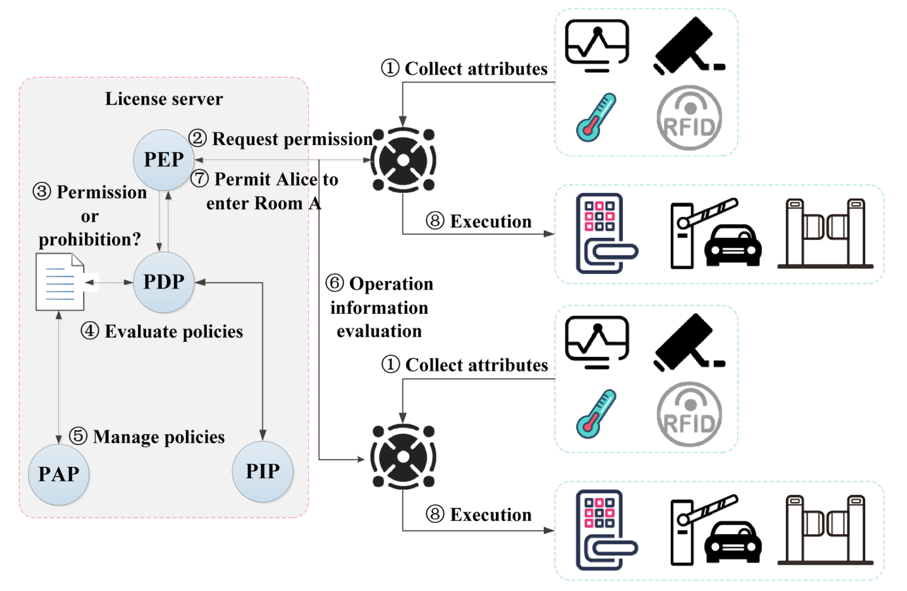

# 赵越老师论文
## 1.漏洞检测(K-means聚类）
[2020 NaNA 1]An Invocation Chain Test and Evaluation Method Based on Knowledge Graph

- 提出了漏洞的样本攻击方法，包含原子攻击集合
- 提出了调用链的自动创建算法，用以获取目标系统易受攻击的混合信息与调用链信息

传统的网络安全防御手段只能检测已经发生过的攻击行为，主要依靠于规则匹配，是被动的

知识图谱提供了可观察整个攻击路径的视角
修复信息系统漏洞的问题：
1）很难及时获取官方的漏洞补丁
2）在漏洞修复后，需要重启服务
然而对于有高实时性要求的公司，修复一个个漏洞的代价太高

使用基于密度的空间聚类方法对应用聚类，能鉴别噪声数据。将高维数据降维，并划分到几个簇中。基于密度的聚类算法能被用来过滤离群的噪声数据。

本文中，使用了EM肘方法来确定K-means的最优k值，并使用K-means聚类分析通用CVE。实验显示取了很好的检测效果，该算法解决了传统K-means无法确定聚类数的问题。流程为：
1）通过漏洞扫描工具存储数据信息
2）预处理目标环境：通过使用**决策树**算法并**分类**漏洞数据库的信息来生成一个可执行的原子攻击集合
3）制定一个知识图谱来获取可实现的调用链

### 系统模型
（1）软件漏洞聚类方法

使用均方误差SSE来度量聚类效果

（2）知识图谱构建算法
知识图谱中每个节点表示目标网络和攻击者的全局状态，通常包含：主机名，使用发授权等；每条边表示一个原子攻击（攻击的执行可能改变全局状态）
只有全局状态到达攻击目标的攻击路径才能反应攻击者的所有攻击轨迹，所以在自动化构建图谱时，需要越过许多与攻击不相关的状态

（3）网络安全评估模型
基于决策树算法的目标环境预处理方法

### 调用链的构建与有效性评估

（1）数据预处理阶段
漏洞信息抽取 -> 分词 -> 停用词 -> TF-IDF特征矩阵

（2）K-means聚类阶段

KG-SRC框架（基于知识图谱的安全风险计算）
1）风险识别

2）风险计算

Step 1： 漏洞数据库建模（对成功侵入的漏洞的前提和结果进行抽象 -> 为生成知识图谱提供因果支撑）
Step 2：目标环境建模（对主机配置，网络配置，漏洞和其他信息进行抽象 -> 攻击者对目标网络的攻击能力）
Step 3：目标环境预处理（根据主机分类目标环境的属性，然后基于谓词名称分类每个属性的类型）
Step 4：自动创建知识图谱（攻击者初始攻击能力，攻击模型实例）
[网络安全风险计算]
Step 5: 威胁产生概率计算（最大成功概率，累积概率）
Step 6：威胁计算结果
Step 7：资产的重要性度量
Step 8：主机的重要性度量
Step 9：主机和网络安全风险计算

## 2.安全检测(调用链）
[2020 WCMC 1] An Invocation Chain Test and Evaluation Method for Fog Computing

一种用于雾计算安全性测试的调用链技术

雾计算网络有许多节点和复杂的连接，雾计算网络系统面对的安全风险与传统云计算系统十分不同。
其节点是分散并暴露的，在硬件层面容易被攻击。因为这些系统有不同设备架构、协议和服务提供商，现有的入侵检测技术很难检测攻击。

### 雾计算系统环境的威胁建模
检测雾计算系统环境
获取系统运行状态，建立系统环境模型

## 3. 加密搜索
[2021 CCISP 3] A dense state search method in edge computing environment

云端基于计算的边缘设备的共享环境存在着搜索密钥和授权密钥分享造成的数据信息泄露问题

针对此，本文提出了一套在**边缘计算环境**中**基于公钥搜索算法**的密码搜索方法

## 4. 访问控制
[2021 CCISP 1] A Security Access Control Scheme of Smart Community under Epidemic Situation

- 基于属性的访问控制技术 -> 判断用户能否通过智能访问控制  
- 新的冲突检测和决策方法 -> 解决不同园区授权可能存在的联合冲突  

## 5. 安全协议实验框架
[2021 CCISP 3] Design of scenario experiment framework for security protocol

在安全协议搜索和设计领域，大多数研究缺乏实际的场景，导致设计过于理想而在实际应用中不够安全。

提出了一种安全协议场景的实验框架。协议的研究人员可以使用这套框架来快速构建一个面向真实应用场景的协议的实验环境

## 6. 加密流量识别与分类
[2021 BDAI 1] A Classification and Identification Technology of TLS Encrypted Traffic Applications

针对传输层安全加密流量，基于隐马尔科夫模型和长短期记忆网络的对加密流量的应用程序鉴别和应用协议分类技术

## 7. 安全计算架构 
[2022 BDAI 1] The Secure Computing Architecture for Dual Hard Disk and Dual System Switching

提出了一种基于双向硬盘和双系统交换的安全技术架构，并提供了一种敏感数据拷贝和两种计算机操作环境的传输过程的机制

不仅为所有的涉及敏感文件的操作链接提供了安全计算环境，还抵抗了潜在的恶意攻击

## 8. 加密流量检测
[2021 IEEE Access 1] Edge Intelligence Based Identification and Classification of Encrypted Traffic of Internet of Things

提出了一种基于边缘智能的物联网加密流量检测模型，可以减少分布式物联网网关的通信时间和加密流量检测模型的创建时间

- 时间序列行为分析
- 动态行为分析
- 关键行为分析
- 两轮过滤分析

## 9. 路由表安全查询
[2022 Symmetry 1] SQRT: A Secure Querying Scheme of Routing Table Based on Oblivious Transfer

用户和服务器信息不对称，导致当我们使用路由地址协议时，很难在联合使用信息和信息共享时避免信息泄露。

提出了一种新的基于未知转移的路由表安全查询方案（SQRT） -> 确保使用设备和目录服务器遵循路由查询协议，并且保护园区双方的隐私信息

SQRT使得目录服务器不能仅发送需要的路由节点给用户设备，而且确保目录服务器不能知晓确切的路由节点（从用户设备接收到的）。并且保护了暴露给目录服务器中的其他路由节点的信息。

## 10. 访问控制与安全管理
[2021 Sensors 1] A Security Management and Control Solution of Smart Park Based on Sensor Networks

为将个人和设备的场景转到不同的智慧园区，提出了一种**联合授权**和**动态访问控制**的机制。
提供统一的鉴别管理服务，访问控制服务，协议管理服务。并有效解决了多端授权问题。

为了实现个人篡改证据存储和设备移动轨迹，设计了基于Merkle树的移动轨迹可追溯协议

（联合授权：由不同的管理员来限制用户的访问权限，从而使多个策略协同工作来确定一个用户是否可以访问某个区域，这将导致策略冲突的问题。  
动态访问：动态获取权限；根据收集的数据来决定授权；授权的可变性）

### 现有问题
- 缺乏统一的权限控制技术和动态高效的授权和撤销能力
- 智能园区使用的集中式数据处理模型效率低下，检测和反馈不能满足及时性的要求
- 在智能园区发生公共安全事件时，现有的智能园区安全管控方案大多没有考虑对人与设备移动轨迹的追溯 -> 默克尔树

### 系统模型

②智能网关没有用户的身份信息和策略信息，需要通过传感器网络向许可证服务器提交请求，协商获得可用的许可证。

**策略执行点(PEP)** 是策略使用控制的程序组件，负责生成授权请求并执行

**策略决策点(PDP)** 返回的授权响应。当允许用户主体的使用请求时，PDP负责执行策略判断和决策。

**策略信息点(PIP)** : 为了提供更准确的决策，PDP可能还需要查询PIP，以收集关于属性的描述性信息或查找第三方提供的策略信息。

**策略管理点(PAP)** 是制定和管理策略和策略集的系统实体

**ABAC (attribute-based access control)机制**支持对用户是否可以访问智能园区的某个区域进行细粒度的访问控制。属性主要包括主体属性、对象属性、环境属性和操作属性

 