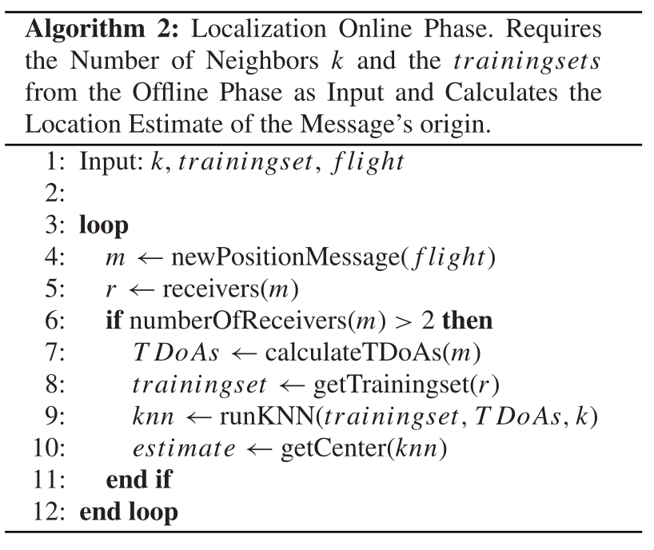

## Comparative evaluation of Received Signal-Strength Index (RSSI) based indoor localization techniques for construction jobsites

### 摘要

本文评估了几种基于RSSI的定位技术在现场工作场所的准确性，并将其与在运行中的建筑物中获得的结果进行了比较。基于RSSI的定位算法被测试 由于其相对较低的成本和潜在的准确性。四种不同的定位算法（MinMax, 最大似然法、环形重叠圈RSSI和K-近邻法）在两个地点都进行了评估。结果表明，所测试的定位算法在施工现场的表现不如在作业现场的表现好。在施工现场的表现不如在运营大楼里的表现。简单的MinMax算法比其他算法有更好的表现 在信标密度为0.186/m2的情况下，平均误差低至1.2米，优于其他算法。. 环形 环形重叠圈RSSI算法也被证明具有良好的效果，并避免了其他算法的实施困难。的研究人员，在一些测试案例中具有良好的准确性，但可能对信标定位特别敏感 定位特别敏感。

## Outdoor Fingerprinting Localization using Sigfox

### 摘要

物联网（IoT）使现代社会将我们环境中的一切都连接到网络上。在无数的物联网应用中，智能设备需要被定位。这可以通过基于卫星的接收器轻松完成。然而，还有更多节能的定位技术，特别是在低功率广域网（LPWAN）中。在这项研究中，我们使用公开的大型户外Sigfox数据集讨论了户外指纹识别技术的准确性。一个kNN（k Nearest Neighbors）算法被应用于我们的指纹数据库。评估了31种不同的距离函数和四种RSS数据表示法。我们的分析表明，一个Sigfox发射器可以被定位，平均估计误差为340米。

## Outdoor Localization Using BLE RSSI and Accessible Pedestrian Signals for the Visually Impaired at Intersections

## 摘要

为盲人和视觉障碍者设计，解决复杂路径导引问题
we propose an assistive system called CAS (Crossing Assistance System) which extends the principle of the **BLE(Bluetooth Low Energy)** **RSSI (Received Signal Strength Indicator)** signal for outdoor and indoor
location tracking.

We achieved 99.8% accuracy using kNN with the features being the average values of each RSSI over a sliding 3s window for moving average.

## A k-NN-Based Localization Approach for Crowdsourced Air Traffic Communication Networks

基于KNN的网格空中交通定位方法

- ADS-B完全依赖于飞机向其他飞机和地面站正确地广播自己的位置
- MLAT可以通过利用在几个不同地面站接收到的信号的到达时间差(TDoA)提供一种独立的定位方法

贡献：

- 提出了一种基于网格的基于无线信号的飞机定位方法
- 分析了目前最先进的飞机定位解决方案MLAT的缺点
- 在真实世界的数据上评估了我们的方法，并表明它在广域环境下比MLAT表现得更好
- 研究验证了ATC数据的有效性

k-NN算法已被证明在短距离、室内RSS指纹识别方面表现非常好，尽管在长距离场景(如飞机定位)中研究较少，而且在非常大的数据库中计算成本可能会更高

预期TDOAs的计算，发送方到接收方的距离除以光速：

对于最近接收器i，期望TDoAs减去其他接收器的最小结果时间$t_{min}$

1）训练阶段：

2）测试阶段：

