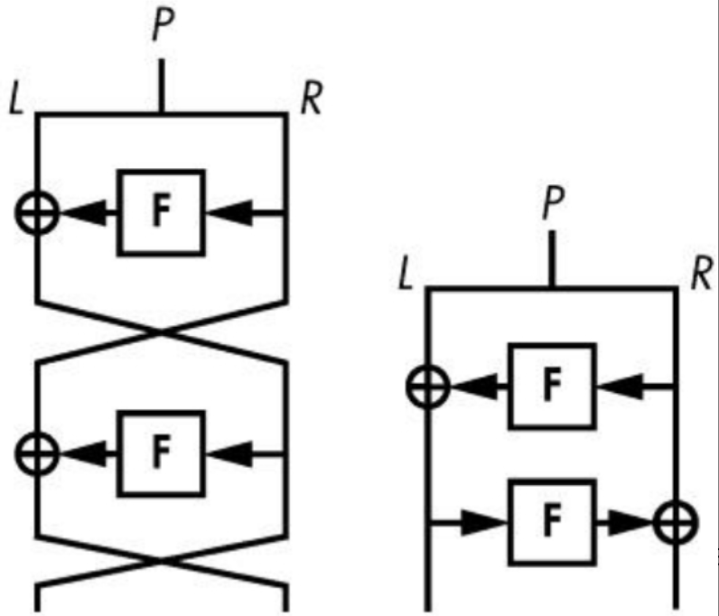
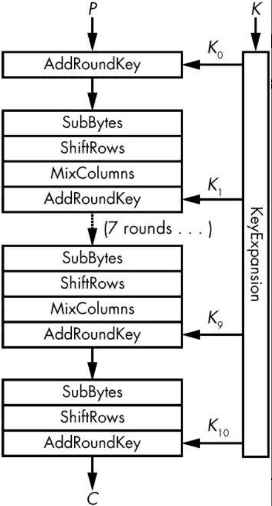
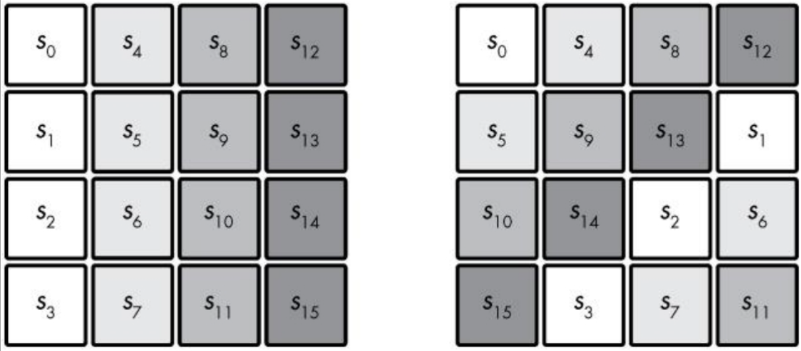
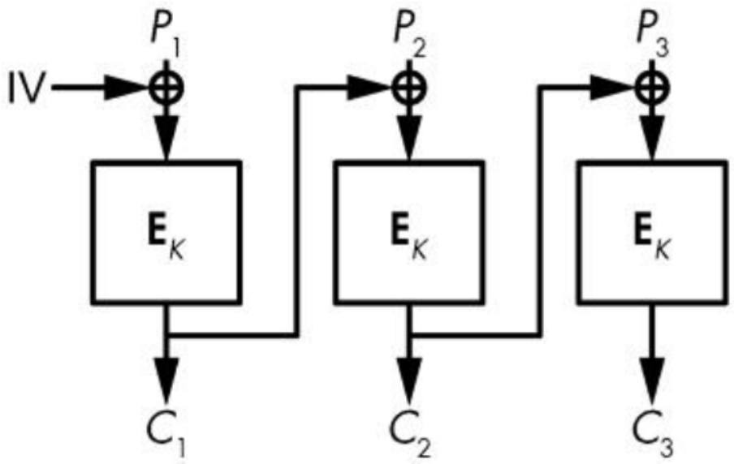
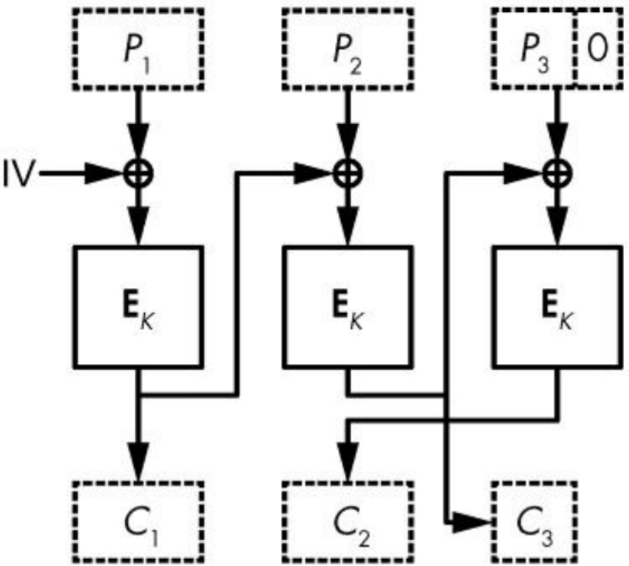
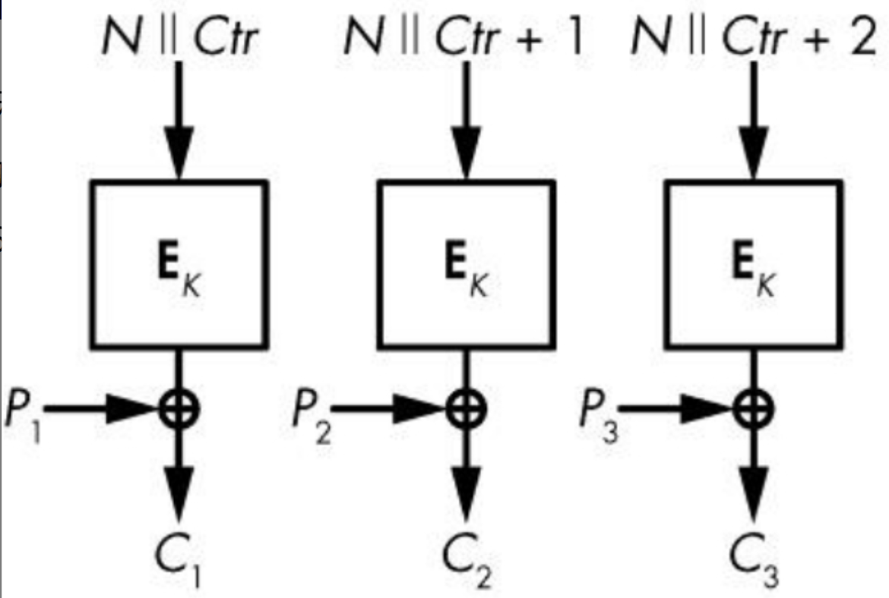
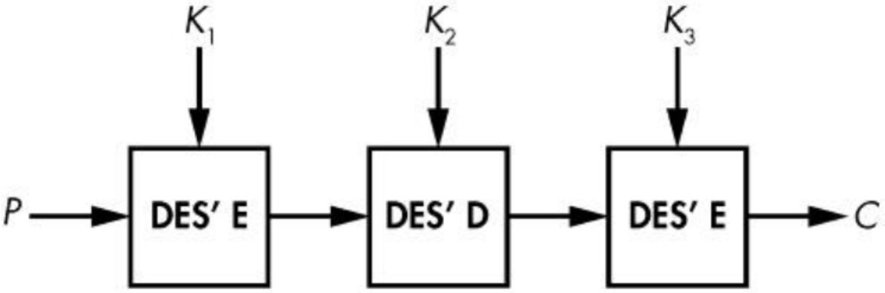
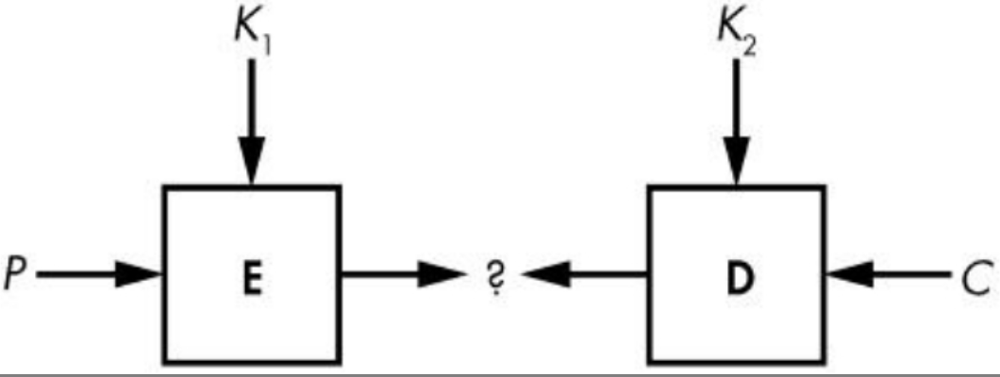
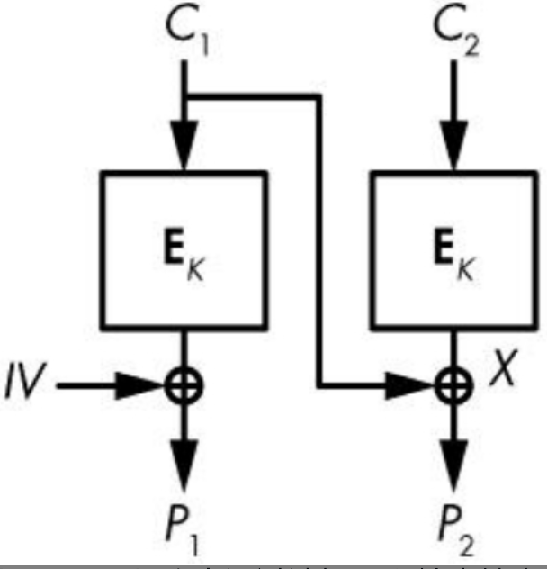

# Serious Cryptography

## 第1章 加密
古典密码：

- Caesar：单个固定移位密钥
- Vigenere：多个固定移位密钥

> 攻击方法：1）找出密钥长度；2）频率分析法；

密码是如何工作的：

- 置换（由密钥确定，不同密钥不同置换，尽可能随机）
- 操作模型

**一次一密**：

$C=P \oplus K$

知道密文后，除了明文的长度，得不到关于明文的任何信息

Kerckhoffs原则：密码的安全性应仅取决于密钥的保密性，而不应取决于加密算法的保密性

攻击模型：

- 唯密文攻击者（ciphertext-only attackers，COA）
- 已知明文攻击者（known-plaintext attackers，KPA）
- 选择明文攻击者（chosen-plaintext attackers，CPA）
- 选择密文攻击者（chosen-ciphertext attackers，CCA）

**安全目标**：

- 不可区分性（Indistinguishability，IND）：密文应接近随机字符串
- 不可塑性（Non-malleability，NM）：

给定密文$C_1 = E(K, P_1)$，不能存在$C_2$，其对应明文$P_2$与$P_1$相关。（一次一密是可塑的）

> $C_1 = P_1 \oplus K$  ;  $C_2 = C_1 \oplus 1$  ;  则$P_2 = P_1 \oplus K \oplus 1$

**安全概念**

- 语义安全和随机加密：IND-CPA

IND-CPA安全性要求，对同一明文加密两次，则加密系统必须返回不同的密文。

语义安全密码的简单构建——使用确定性随机比特发生器（deterministicrandom bit generator，DRBG）
$$
E(K,R,P) = (DRBG(K||R) \oplus P,R)
$$
$K||R$表示由密钥K和随机选择的字符串R组成的字符串

> 对于选择明文攻击者，知道密文$DRBG(K||R) \oplus P$和明文$P$，可以求得$DRBG(K||R)$，但如果DRBG满足INA，则依然无法区分$DRBG(K||R)$和$R$


## 第2章 随机性
- 随机与非随机（一个样本值难以判断是否是随机数）
- 随机过程可以用**概率分布**刻画  
当概率分布中所有事件出现的概率都相等时，该分布为一致分布
- 熵：不确定性的度量  
熵越大，确定性就越小。计算概率分布的熵：
$$
-p_1 \times \log(p_1) - p_2 \times \log(p_2) ... -p_N \times \log(p_N)
$$
(负号使得求得的熵为正值) 一致性分布的熵最大

- 随机数发生器和伪随机数发生器(RNG与PRNG)  
随机性来自自然环境（仅基于计算机算法不能产生随机性）  
量子随机数发生器(QRNG): 依赖于量子力学现象（放射性衰败，真空涨落等）实践中可能有偏差且不能快速产生比特。  
1）RNG以**非确定**的方式从**模拟源**相对缓慢地产生**真随机比特**，不保证高熵；  
2）PRNG依赖于RNG，以**确定**的方法从**数字源**快速生成**看起来随机**的比特，并具有最大熵。


PRNG工作流程：  
（1）init()：初始化操作，即初始化熵池和内部状态  
（2）refresh(R)：更新操作，即使用数据R更新熵池  
（3）next(N)：下一次操作，即返回N个伪随机比特并更新熵池

PRNG应该实现抗回溯（前向保密）和抗预测（后向保密）  
PRNG应该定期使用攻击者难以猜测的R值来调用refresh
> Fortuna是Windows中使用的PRNG结构(32个熵池)

- 非加密PRNG:旨在为应用生成良好、均匀的分布（关注比特之间的概率分布质量）
> Mersenne Twister（MT）算法是用于PHP、Python、R、Ruby和许多其他系统的非加密PRNG
- 加密PRNG：加密PRNG一定要是不可预测的，同时必须能生成具有良好分布的比特序列

## 第3章　密码学中的安全性
### 3.1 不可能的定义  
（1）信息安全性是理论上的不可能性  
（2）计算安全性是实践中的不可能性

计算安全性的表达式：$(t, \mathcal{E})$，其中t为攻击者可执行操作的上限，$\mathcal{E}$为攻击成功的概率上限

### 3.2 量化安全性
- 以比特度量安全性  
知道破解一个密码大约需要多少次操作，那么就可以通过取操作数的二进制对数来确定它的安全强度（以比特为单位）  
> 如果需要1 000 000次操作，安全强度为$\log_2(1000000)$，大约为20bit
- 全攻击成本  
（1）并行性  
（2）内存（需要多少空间，以及内存速度）  
（3）预计算（可复用的计算）  
（4）目标数量（攻击的成本随着目标数量的增加而降低）

- 选择和评估安全强度  
如果将1秒细化为更小的单位，即1秒有10亿纳秒。假设用现代技术测试一个密钥需要不少于1纳秒的时间，即使测试一个密钥只需要1纳秒。

为了确保长期的安全性，应该选择256比特的安全性或接近256比特的安全性。
> $2^{256}$次操作才能破解密码

### 3.3 安全实现
- 可证明安全性  
归约，破解的难度至少和另外一个已知问题一样困难  
1）与数学问题相关的证明  
大数分解：已知$n = pq$，求素数$p$和$q$的值  
2）与密码问题相关的证明  
证明一个密码算法并不比另一个算法弱  

注意：理论证明的安全性，不一定一定安全 -> 密码学中的证明只是相对真理的证明
> 密码学家拉尔斯·克努森（Lars Knudsen）曾经说过，“如果可以证明它是安全的，那么它很可能是不安全的”

`如果能在没有密钥的情况下从密文恢复明文，您将绕过证明，恢复密钥几乎不重要`

- 启发式安全性  
大多数对称密码并没有安全性证明。在可证明安全性不适用的情况下，信任这个密码的唯一理由就是因为许多技术人员试图攻破密码但都失败了，这有时被称为启发式安全性。

### 3.4 生成密钥
密钥可以通过以下三种方式之一生成：  
（1）随机生成：使用伪随机数发生器（PRNG）和密钥生成算法（在需要时）  
（2）从一个口令生成：使用密钥派生函数（KDF），将用户提供的口令转换为密钥  
（3）通过密钥协商协议生成：该协议是两方或更多方之间的一系列消息交换，最终建立一个共享密钥  

1）生成对称密钥  
对称密钥的长度通常与它们所能提供的安全强度相同：即128比特的密钥提供128比特的安全性

> 可以使用OpenSSL工具包来随机生成一个 `openssl rand 16 -hex`  

2）生成非对称密钥  
要生成一个非对称密钥，您可以将伪随机比特作为种子发送到密钥生成算法
> 使用OpenSSL生成4096比特的RSA私钥  `openssl genrsa 4096`

3）保护密钥
（1）密钥包装（使用第二个密钥来加密第一个密钥）
（2）从口令中即时生成
（3）将密钥存储在硬件令牌（智能卡或USB加密狗）上
> 使用aes进行密钥包装  `openssl genrsa -aes128 4096`

## 第4章　分组密码
### 4.1 什么是分组密码
分组密码由加密算法($C = \mathbf{E}(K, P)$)和解密算法($P = \mathbf{D}(K, C)$)组成  

1）分组大小  
大多数分组密码具有64比特或128比特分组（考虑内存占用与计算效率）

2）码本攻击  
分组太小容易受到码本攻击，码本攻击是用16比特分组进行的：  
得到对应于每个16比特明文分组的65 536（216）个密文，建立一个查找表。

### 4.2 如何构造分组密码
- 分组密码的轮数  
轮函数容易实现与复用，且应该有一个逆，便于计算回明文。轮函数（$\mathbf{R}_1$、$\mathbf{R}_2$等）通常用的是相同的算法，但它们由不同的子密钥进行区分  

- 滑动攻击和子密钥
若轮与轮之间相同，可利用滑动攻击破解：  
寻找两个明文-密文对：$(P_1, C_1)$, $(P_2, C_2)$ 可知
$P_2 = \mathbf{R}(P_1)$    =>   $C_2 = \mathbf{R}(C_1)$   
知道一轮的输入和输出常常有助于恢复密钥

- 替换-置换网络  
混淆（关于深度） -> 输入（明文和加密密钥）经历复杂的变换（替换）  
扩散（关于宽度） -> 这些变换等同地依赖于输入的所有比特位（置换）  

替换 ->  S盒或替换盒  
扩散 ->  线性代数和矩阵乘法来混合比特  

- Feistel结构  
20世纪70年代，IBM设计的：  
（1）将64比特分成两个32比特的$L$和$R$；
（2）设$L$为$L \oplus \mathbf{F}(R)$，$\mathbf{F}$是替换-置换轮函数；  
（3）交换$L$和$R$的值；  
（4）转到步骤（2），重复15次；  
（5）合并$L$和$R$为64比特输出分组。  
  
交替使用$L = L \oplus \mathbf{F}(R)$，$R = R \oplus \mathbf{F}(L)$。（两次轮函数使用的子密钥不同）  

### 4.3 高级加密标准（AES）
- AES内核  
AES使用128比特、192比特或256比特的秘密密钥处理128比特的分组  

为了转换明文状态，AES使用如下图所示的SPN结构，其中128比特密钥计算10轮，192比特密钥计算12轮，256比特密钥计算14轮  



每轮的四个步骤：  
（1）AddRoundKey：异或（XOR）子密钥以生成一个内部状态【加密不依赖于密钥】  
（2）SubBytes：利用S盒把（s0，s1，…，s15）中的每个字节都替换成一个新的字节。在这个例子中，S盒是256个元素的查找表。【引入非线性操作】  
（3）ShiftRows：对状态中第i行循环移动i个位置，范围从0到3。  

（4）MixColumns：对状态的4列中的每一列应用相同的线性转换

密钥调度函数KeyExpansion是AES密钥调度算法，它创建11个16字节的子密钥（K0，K1，…，K10），每个子密钥都是由16字节的密钥使用相同S盒进行SubBytes和XOR运算得到的【避免受到滑动攻击】
> 给定任何一个子密钥Ki，攻击者可以通过可逆算法来确定所有其他的子密钥以及主密钥K

AES的最后一轮不包括MixColumns操作（节省无用的线性运算）  

- python使用AES  
```python
from cryptography.hazmat.primitives.ciphers import Cipher, algorithms, modes
from cryptography.hazmat.backends import default_backend
from binascii import hexlify as hexa
from os import urandom

# 16位伪随机密钥种子
k = urandom(16)
cipher = Cipher(algorithms.AES(k), modes.ECB(), backend = default_backend())
aes_encrypt = cipher.encryptor()
aes_decrypt = cipher.decryptor()

# 明文
p = '\x00' * 16

# 加密
c = aes_encrypt.update(p) + aes_encrypt.finalize()
print(hexa(c))

# 解密
p = aes_decrypt.update(c) + aes_decrypt.finalize()
print(hexa(p))
```

### 4.4 实现AES
AES快速实现软件使用特殊的技术，其被称为基于表的实现和原生指令集  
- 基于表的实现  
基于表的实现利用**查询硬编码**在程序中并在执行时加载到内存中的表和XOR运算组合操作替换了SubBytes-ShiftRows-MixColumns运算  
容易受到基于时间的缓存攻击，当程序读取或写入缓存内存中的元素时，基于时间的缓存攻击利用时间变化差异进行攻击

- 原生指令集  
AES-NI解决了AES软件实现中存在的基于时间的缓存攻击问题

### 4.5 工作方式
- 电码本模式（ECB）  
$C_i=\mathbf{E}(K,P_i)$，ECB模式不安全，相同的密文分组对应相同的明文分组  
- 密码分组链接（CBC）模式  
$C_i=\mathbf{E}(K,P_i \oplus C_{i-1})$


每个密文分组依赖于所有先前的分组，并确保相同的明文分组不会生成相同的密文分组

加密第一个分组P1时，没有以前的密文分组可以使用，所以CBC取一个随机的初始值（IV） -> 保证两次加密调用不同的初始值

- 如何在CBC模式中加密消息  
处理长度不是分组长度的倍数的明文:
(1)填充，使密文比明文稍长  
(2)密文窃取，产生与明文长度相同的密文  

- 填充消息  
分组密码的填充采用RFC 5652中制定的PKCS#7标准

- 密文窃取  
密文与明文的长度完全相同，密文窃取可以抵御Padding Oracle攻击

在CBC模式下，密文窃取用前一个密文分组的比特扩展最后一个不完整的明文分组，然后对得到的分组进行加密。

我们有三个分组，其中最后一个分组P3是不完整的（用零表示）。P3异或（XOR）前一个分组密文的后一部分，得到的加密结果为C2。最后的密文分组C3，是前一个密文分组的前一部分组成的。解密则是逆运算。

- 计数（CTR）模式  
把分组密码转换成序列密码  
分组密码算法不会转换明文数据。相反，它将加密由计数器和随机数（nonce）组成的分组。  
1）在消息中没有两个分组使用相同的计数器，但是不同的消息可以使用相同的计数器序列
2）随机数是一个只使用一次的数字，对于一条消息中的所有分组都是相同的，但是没有两个消息会使用相同的随机数

在CTR模式下，加密算法就是使**明文**XOR（异或）**随机数N和计数器Ctr得到的序列**，解密也是相同的


与CBC的初始值不同，CTR的随机数不需要是随机的，它只需要是唯一的。

CTR的一个特别的好处是，它比其他模式更快。它不仅是并行的，而且您甚至可以在知道消息之前先加密，方法是选择一个随机数，事先计算稍后将与明文进行异或操作的流。

### 4.6 攻击方式
- 中间相遇攻击  
3DES使用加密-解密-加密模式而非加密三次，是因为允许系统在必要时调用3DES接口使用DES

MitM攻击将使得双DES只能像单个DES一样安全  

中间相遇攻击双DES的过程：  
（1）已知明文$P$和两个未知的56比特密钥$K_1$和$K_2$，$C = \mathbf{E}(K_2, \mathbf{E}(K_1, P))$  
（2）对于$K_2$的所有$2^{56}$个值，计算$\mathbf{D}(K_2, C)$并检查结果值作为索引  
（3）如果发现中间值作为表的索引，则从表中取出响应一致的$K_1$，并通过使用其他相对应的$P$和$C$验证找到的$(K_1,K_2)$是否正确


- Padding Oracle攻击  
一个根据CBC加密密文中的填充是否有效而有不同行为的系统。
给定一个Padding Oracle，其记录哪些是有效的输入，哪些是无效的输入，并利用这些信息来解密所选择的密文。

假设要解密密文分组$C_2$，$X$为您要查找的值，$P_2$为在CBC模式下解密后获得的明文分组  
如果选择一个随机分组$C_1$，并将两个分组密文$C_1||C_2$发送到算法  
解密将在$C_1⊕P_2＝X$以有效填充结尾时才成功

