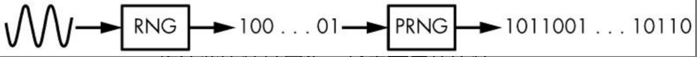

# Serious Cryptography

## 第1章 加密
古典密码：

- Caesar：单个固定移位密钥
- Vigenere：多个固定移位密钥

> 攻击方法：1）找出密钥长度；2）频率分析法；

密码是如何工作的：

- 置换（由密钥确定，不同密钥不同置换，尽可能随机）
- 操作模型

**一次一密**：

$C=P \oplus K$

知道密文后，除了明文的长度，得不到关于明文的任何信息

Kerckhoffs原则：密码的安全性应仅取决于密钥的保密性，而不应取决于加密算法的保密性

攻击模型：

- 唯密文攻击者（ciphertext-only attackers，COA）
- 已知明文攻击者（known-plaintext attackers，KPA）
- 选择明文攻击者（chosen-plaintext attackers，CPA）
- 选择密文攻击者（chosen-ciphertext attackers，CCA）

**安全目标**：

- 不可区分性（Indistinguishability，IND）：密文应接近随机字符串
- 不可塑性（Non-malleability，NM）：

给定密文$C_1 = E(K, P_1)$，不能存在$C_2$，其对应明文$P_2$与$P_1$相关。（一次一密是可塑的）

> $C_1 = P_1 \oplus K$  ;  $C_2 = C_1 \oplus 1$  ;  则$P_2 = P_1 \oplus K \oplus 1$

**安全概念**

- 语义安全和随机加密：IND-CPA

IND-CPA安全性要求，对同一明文加密两次，则加密系统必须返回不同的密文。

语义安全密码的简单构建——使用确定性随机比特发生器（deterministicrandom bit generator，DRBG）
$$
E(K,R,P) = (DRBG(K||R) \oplus P,R)
$$
$K||R$表示由密钥K和随机选择的字符串R组成的字符串

> 对于选择明文攻击者，知道密文$DRBG(K||R) \oplus P$和明文$P$，可以求得$DRBG(K||R)$，但如果DRBG满足INA，则依然无法区分$DRBG(K||R)$和$R$

## 第2章 随机性
- 随机与非随机（一个样本值难以判断是否是随机数）
- 随机过程可以用**概率分布**刻画  
当概率分布中所有事件出现的概率都相等时，该分布为一致分布
- 熵：不确定性的度量  
熵越大，确定性就越小。计算概率分布的熵：
$$
-p_1 \times \log(p_1) - p_2 \times \log(p_2) ... -p_N \times \log(p_N)
$$
(负号使得求得的熵为正值) 一致性分布的熵最大

- 随机数发生器和伪随机数发生器(RNG与PRNG)  
随机性来自自然环境（仅基于计算机算法不能产生随机性）  
量子随机数发生器(QRNG): 依赖于量子力学现象（放射性衰败，真空涨落等）实践中可能有偏差且不能快速产生比特。  
1）RNG以**非确定**的方式从**模拟源**相对缓慢地产生**真随机比特**，不保证高熵；  
2）PRNG依赖于RNG，以**确定**的方法从**数字源**快速生成**看起来随机**的比特，并具有最大熵。

PRNG工作流程：  
（1）init()：初始化操作，即初始化熵池和内部状态  
（2）refresh(R)：更新操作，即使用数据R更新熵池  
（3）next(N)：下一次操作，即返回N个伪随机比特并更新熵池

PRNG应该实现抗回溯（前向保密）和抗预测（后向保密）  
PRNG应该定期使用攻击者难以猜测的R值来调用refresh
> Fortuna是Windows中使用的PRNG结构(32个熵池)

- 非加密PRNG:旨在为应用生成良好、均匀的分布（关注比特之间的概率分布质量）
> Mersenne Twister（MT）算法是用于PHP、Python、R、Ruby和许多其他系统的非加密PRNG
- 加密PRNG：加密PRNG一定要是不可预测的，同时必须能生成具有良好分布的比特序列

## 第3章　密码学中的安全性
### 3.1 不可能的定义  
（1）信息安全性是理论上的不可能性  
（2）计算安全性是实践中的不可能性

计算安全性的表达式：$(t, \mathcal{E})$，其中t为攻击者可执行操作的上限，$\mathcal{E}$为攻击成功的概率上限

### 3.2 量化安全性
- 以比特度量安全性  
知道破解一个密码大约需要多少次操作，那么就可以通过取操作数的二进制对数来确定它的安全强度（以比特为单位）  
> 如果需要1 000 000次操作，安全强度为$\log_2(1000000)$，大约为20bit
- 全攻击成本  
（1）并行性  
（2）内存（需要多少空间，以及内存速度）  
（3）预计算（可复用的计算）  
（4）目标数量（攻击的成本随着目标数量的增加而降低）

- 选择和评估安全强度  
如果将1秒细化为更小的单位，即1秒有10亿纳秒。假设用现代技术测试一个密钥需要不少于1纳秒的时间，即使测试一个密钥只需要1纳秒。

为了确保长期的安全性，应该选择256比特的安全性或接近256比特的安全性。
> $2^{256}$次操作才能破解密码

### 3.3 安全实现
- 可证明安全性  
归约，破解的难度至少和另外一个已知问题一样困难  
1）与数学问题相关的证明  
大数分解：已知$n = pq$，求素数$p$和$q$的值  
2）与密码问题相关的证明  
证明一个密码算法并不比另一个算法弱  

注意：理论证明的安全性，不一定一定安全 -> 密码学中的证明只是相对真理的证明
> 密码学家拉尔斯·克努森（Lars Knudsen）曾经说过，“如果可以证明它是安全的，那么它很可能是不安全的”

`如果能在没有密钥的情况下从密文恢复明文，您将绕过证明，恢复密钥几乎不重要`

- 启发式安全性  
大多数对称密码并没有安全性证明。在可证明安全性不适用的情况下，信任这个密码的唯一理由就是因为许多技术人员试图攻破密码但都失败了，这有时被称为启发式安全性。

### 3.4 生成密钥
密钥可以通过以下三种方式之一生成：  
（1）随机生成：使用伪随机数发生器（PRNG）和密钥生成算法（在需要时）  
（2）从一个口令生成：使用密钥派生函数（KDF），将用户提供的口令转换为密钥  
（3）通过密钥协商协议生成：该协议是两方或更多方之间的一系列消息交换，最终建立一个共享密钥  

1）生成对称密钥  
对称密钥的长度通常与它们所能提供的安全强度相同：即128比特的密钥提供128比特的安全性

> 可以使用OpenSSL工具包来随机生成一个 `openssl rand 16 -hex`  

2）生成非对称密钥  
要生成一个非对称密钥，您可以将伪随机比特作为种子发送到密钥生成算法
> 使用OpenSSL生成4096比特的RSA私钥  `openssl genrsa 4096`

3）保护密钥
（1）密钥包装（使用第二个密钥来加密第一个密钥）
（2）从口令中即时生成
（3）将密钥存储在硬件令牌（智能卡或USB加密狗）上
> 使用aes进行密钥包装  `openssl genrsa -aes128 4096`

## 第4章　分组密码
### 4.1 什么是分组密码
分组密码由加密算法($C = \mathbf{E}(K, P)$)和解密算法($P = \mathbf{D}(K, C)$)组成  

1）分组大小  
大多数分组密码具有64比特或128比特分组（考虑内存占用与计算效率）

2）码本攻击  
分组太小容易受到码本攻击，码本攻击是用16比特分组进行的：  
得到对应于每个16比特明文分组的65 536（216）个密文，建立一个查找表。

### 4.2 如何构造分组密码
- 分组密码的轮数  
轮函数容易实现与复用，且应该有一个逆，便于计算回明文。轮函数（$\mathbf{R}_1$、$\mathbf{R}_2$等）通常用的是相同的算法，但它们由不同的子密钥进行区分  

- 滑动攻击和子密钥
若轮与轮之间相同，可利用滑动攻击破解：  
寻找两个明文-密文对：$(P_1, C_1)$, $(P_2, C_2)$ 可知
$P_2 = \mathbf{R}(P_1)$    =>   $C_2 = \mathbf{R}(C_1)$   
知道一轮的输入和输出常常有助于恢复密钥

- 替换-置换网络

